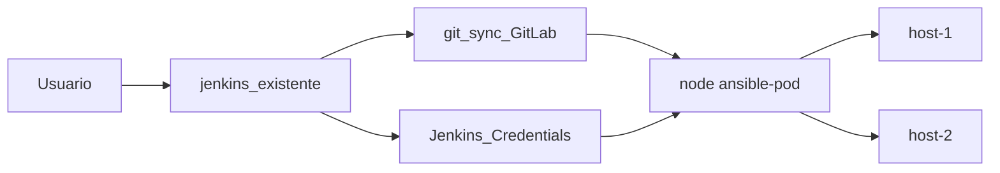

# Scripts de execução + Ansible (Jenkins existente)

## Contexto revisado

A stack Docker (**nginx**, **jenkins**, **ansible-pod**) **já existe** — não será criada neste escopo.

O **ansible-pod** já está registrado no Jenkins como **agente/nó** com label `ansible-pod`. A execução Ansible usa o padrão existente:

```groovy
node('ansible-pod') {
    // checkout + ansible-playbook direto, sem docker exec
}
```

Este repositório GitLab entrega **somente**:

- Estrutura Ansible do job (`job/inventories`, `job/playbooks`)
- Script de execução Jenkins (Pipeline Groovy + helper)
- `ansible.cfg` mínimo
- README com instruções de integração ao Jenkins existente

## Arquitetura (integração com infra existente)



Fluxo do job:

1. Usuário dispara build e escolhe período (hoje / ontem / total).
2. Pipeline aloca agente `ansible-pod` via `node('ansible-pod')`.
3. Dentro do nó: sincroniza repositório GitLab (`checkout scm` + `git pull`).
4. Groovy resolve `log_period` e `log_date` a partir da seleção.
5. Executa `ansible-playbook` **diretamente no agente** para cada playbook/host.
6. Publica artefatos de log no Jenkins.

## Escopo do repositório GitLab

```
jenkins-ansible/
├── README.md
├── ansible.cfg
├── Jenkinsfile
├── scripts/
│   └── resolve-log-period.groovy
└── job/
    ├── inventories/
    │   └── hosts.yaml
    └── playbooks/
        ├── playbook-host-1.yaml
        └── playbook-host-2.yaml
```

**Fora de escopo:** Docker, nginx, plugins, JCasC, `docker exec`.

## Premissas da infra existente

| Item | Valor | Descrição |
|------|-------|-----------|
| Agente Jenkins | `ansible-pod` | Label do nó onde roda Ansible |
| Workspace | `$WORKSPACE` | Checkout Git disponível no agente |
| `GIT_CREDENTIALS_ID` | `gitlab-repo` | Credencial para clone/pull |
| `SSH_CREDENTIALS_ID` | `ssh-hosts` | Username/password SSH dos hosts |

O agente `ansible-pod` já deve ter `ansible-playbook` instalado e acesso de rede SSH aos hosts remotos.

## Inventário Ansible (simples, sem grupos)

[`job/inventories/hosts.yaml`](job/inventories/hosts.yaml):

```yaml
all:
  hosts:
    host-1:
      ansible_host: 10.0.0.1
    host-2:
      ansible_host: 10.0.0.2
```

Usuário e senha injetados via `-e` a partir de credenciais Jenkins — **não** ficam no inventário.

[`ansible.cfg`](ansible.cfg):

```ini
[defaults]
inventory = job/inventories/hosts.yaml
host_key_checking = False
retry_files_enabled = False
```

## Playbooks (placeholders)

| Variável | Valores | Uso |
|----------|---------|-----|
| `log_period` | `today`, `yesterday`, `total` | Define filtro |
| `log_date` | `YYYY-MM-DD` | Data calculada (ignorada quando `total`) |
| `log_source_path` | `/var/log/app/*.log` | Placeholder — ajustar depois |
| `ansible_user` / `ansible_ssh_pass` | credencial Jenkins | Autenticação SSH |

Um playbook por host (`playbook-host-1.yaml`, `playbook-host-2.yaml`) com tasks placeholder.

## Scripts de execução Jenkins

### Parâmetro de seleção de data

- **Active Choices** (se disponível): opções com datas dinâmicas na UI.
- **Choice nativo** (fallback): `TODAY | YESTERDAY | TOTAL`; datas no log do build.

### [`scripts/resolve-log-period.groovy`](scripts/resolve-log-period.groovy)

Normaliza `params.LOG_PERIOD` → `logPeriod` + `logDate`.

### [`Jenkinsfile`](Jenkinsfile) — padrão `node('ansible-pod')`

Estrutura alinhada ao script atual do usuário:

```groovy
node('ansible-pod') {

    stage('Sincronizar repositório') {
        checkout scm
        sh 'git pull origin "${BRANCH_NAME}" || true'
    }

    stage('Resolver período') {
        def resolved = load 'scripts/resolve-log-period.groovy'
        def result = resolved.call(params.LOG_PERIOD)
        env.LOG_PERIOD = result.logPeriod
        env.LOG_DATE   = result.logDate
    }

    stage('Executar playbooks') {
        withCredentials([
            usernamePassword(
                credentialsId: 'ssh-hosts',
                usernameVariable: 'SSH_USER',
                passwordVariable: 'SSH_PASS'
            )
        ]) {
            sh '''
                set -e
                for pb in job/playbooks/playbook-host-*.yaml; do
                    host=$(basename "$pb" .yaml | sed 's/playbook-//')
                    ansible-playbook \
                        -i job/inventories/hosts.yaml \
                        "$pb" \
                        --limit "$host" \
                        -e "log_period=${LOG_PERIOD} log_date=${LOG_DATE} log_source_path=/var/log/app/*.log ansible_user=${SSH_USER} ansible_ssh_pass=${SSH_PASS}"
                done
            '''
        }
    }

    stage('Publicar artefatos') {
        archiveArtifacts artifacts: 'artifacts/**/*', allowEmptyArchive: true
    }
}
```

**Pontos-chave:**

- **Sem `docker exec`** — `ansible-playbook` roda nativamente no agente `ansible-pod`.
- Paths relativos a `$WORKSPACE` (`job/inventories/...`, `job/playbooks/...`).
- Loop cobre todos os `playbook-host-*.yaml`; novo host = IP no inventário + novo playbook.
- `checkout scm` dentro do `node('ansible-pod')` garante que o agente tenha o código atualizado.

Alternativa declarativa (se preferir stages com agent label):

```groovy
pipeline {
    agent none
    stages {
        stage('Executar') {
            agent { label 'ansible-pod' }
            steps { /* checkout + ansible-playbook */ }
        }
    }
}
```

Recomendação: **scripted pipeline com `node('ansible-pod')` único** — compatível com o padrão já em uso.

## Integração no Jenkins existente

1. Job Pipeline apontando SCM para repo GitLab → `Jenkinsfile` na raiz.
2. Credenciais `gitlab-repo` e `ssh-hosts` cadastradas na UI.
3. Parâmetro `LOG_PERIOD` configurado (Active Choices ou Choice).
4. Validar que o nó `ansible-pod` está online antes do primeiro build.

Validação local no agente:

```bash
ansible-playbook --syntax-check -i job/inventories/hosts.yaml job/playbooks/playbook-host-1.yaml
```

## Ordem de implementação

1. `job/inventories/hosts.yaml` + playbooks placeholder
2. `ansible.cfg`
3. `scripts/resolve-log-period.groovy`
4. `Jenkinsfile` com `node('ansible-pod')`
5. `README.md`

## Decisões mantidas

- Ansible no agente `ansible-pod`; Groovy orquestra, não faz SSH direto.
- Um playbook por host.
- Sync Git dentro do nó antes dos playbooks.
- Placeholders nos playbooks para coleta futura.

## Riscos / pré-requisitos

- Nó `ansible-pod` online e com Ansible instalado.
- Workspace do agente acessível para checkout Git (GitLab acessível pelo agente).
- IDs de credenciais confirmados (`gitlab-repo`, `ssh-hosts`).
